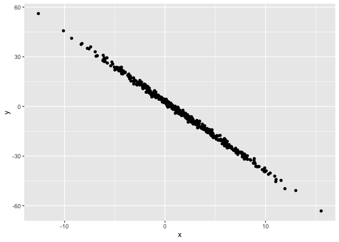
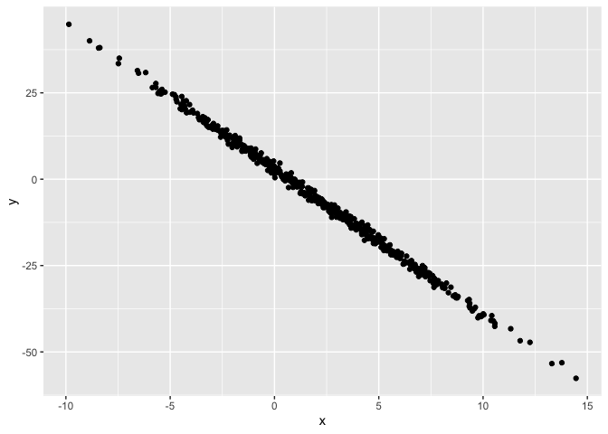
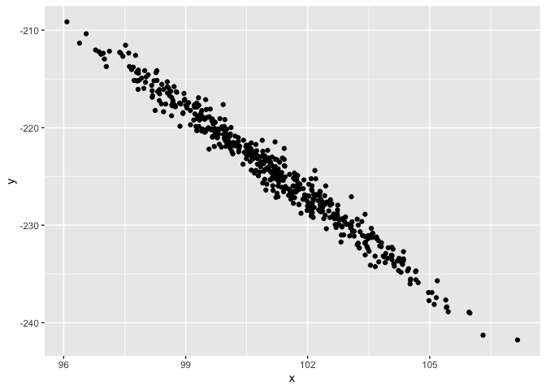
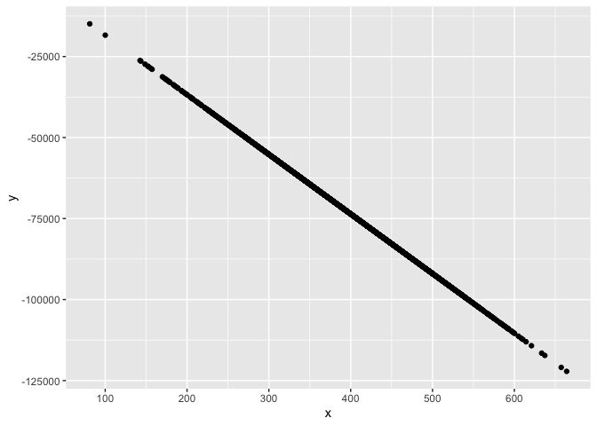
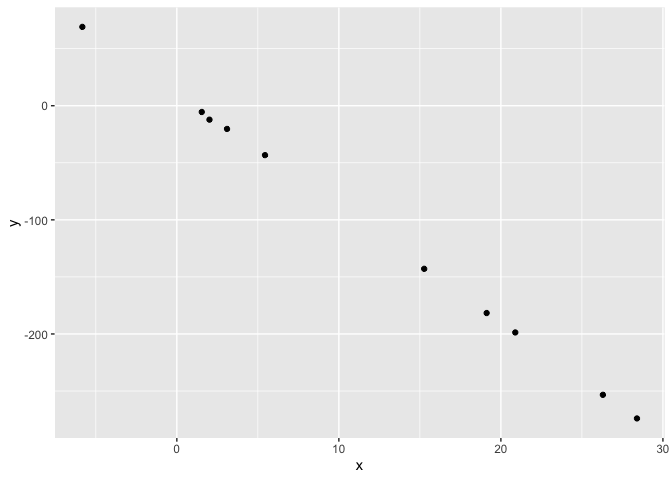
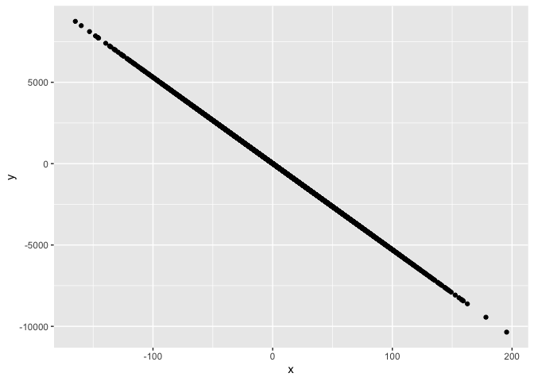

Simple document
================

I’m an R Markdown document! **This means that all written information,
unless otherwise specified, will be treated as normal readable text.**

# Section 1

Here’s a **code chunk** that samples from a *normal distribution*:

``` r
samp = rnorm(100)
length(samp)
```

    ## [1] 100

**^ Here is the “otherwise specific” part,. Anything between three ticks
will be run as a code.**

# Section 2

I can take the mean of the sample, too! The mean is 0.0280707. **This
provides a tiny bit of computation embede within text.**

At the bottom of the script, there is a small section that allows you to
jump thru-out your document. It allows you to easily switch between
different sections and code chunks.

There are important hotkeys to learn 1. **Option + CMD + i**
automatically inserts a blank code chunk

``` r
library(tidyverse)
```

    ## ── Attaching core tidyverse packages ──────────────────────── tidyverse 2.0.0 ──
    ## ✔ dplyr     1.1.2     ✔ readr     2.1.4
    ## ✔ forcats   1.0.0     ✔ stringr   1.5.0
    ## ✔ ggplot2   3.4.2     ✔ tibble    3.2.1
    ## ✔ lubridate 1.9.2     ✔ tidyr     1.3.0
    ## ✔ purrr     1.0.1     
    ## ── Conflicts ────────────────────────────────────────── tidyverse_conflicts() ──
    ## ✖ dplyr::filter() masks stats::filter()
    ## ✖ dplyr::lag()    masks stats::lag()
    ## ℹ Use the conflicted package (<http://conflicted.r-lib.org/>) to force all conflicts to become errors

``` r
plot_df = tibble(
  x = rnorm(500, 2, 4),
  y = 3 - 4.2*x + rnorm(500),
)

ggplot(plot_df, aes(x = x, y = y)) + geom_point()
```

<!-- -->

Now, because this is a RMD, we can add some text which directly explains
the code hih subquently produces the graph. This creates a data frame
and genrates a plot based on the data frame. It shows x.

2.  It is important to give plot chucks names. Not only does it help
    keep things visually clear, when there are many many chunck R will
    be able to say which chunk the error is coming from. Any while it
    may be difficult to find chunk 42/63, it will be much easier to find
    chunk 42 “linear_regression_plot_example”

3.  In the start of a code chunk, it is possibe to set it such that
    ’’’{r}, evaluation_example, eval = FALSE which will not run any
    code, but will still provide code (e.g., to explain the code to
    produce a graph without producing the graph)

For me, however, because I choose to have graphs displayed in-line on
RMD, the graph will always be produced for me.

``` r
plot_df = tibble(
  x = rnorm(500, 2, 4),
  y = 3 - 4.2*x + rnorm(500),
)

ggplot(plot_df, aes(x = x, y = y)) + geom_point()
```

Now, if we do the same thing but instead include a line reading “include
= FALSE” then the code chunk will not be included in the Knitted file -
you can’t see it on the output but trust me it’s there~

``` r
plot_df = tibble(
  x = rnorm(500, 2, 4),
  y = 3 - 4.2*x + rnorm(500),
)

ggplot(plot_df, aes(x = x, y = y)) + geom_point()
```

<!-- -->

Based on all of the above information, it may be a good idea to load the
any libraries in a non-included code chunk at the start of an RMD file.

There another evaluation too. If we set “collapse = TRUE” then we can do
something else. Normally, if you have mutiple outputs being generated in
one code chunk then the result will be -code1, output1, code2, output2,
code3, output3 - etc. But with the collapse functionwe can have it so
that the output of all lines of code come at the end of the code chunk -
code1, code2, code3, output1, output2, output3.

``` r

plot_df_vA = tibble(
  x = rnorm(500, 101, 2),
  y = 79 - 3*x + rnorm(100),
)

ggplot(plot_df_vA, aes(x = x, y = y)) + geom_point()
```

<!-- -->

``` r

plot_df_vB = tibble(
  x = rnorm(3000, 396, 83),
  y = 8 - 184*x + rnorm(130),
)
## Warning in 8 - 184 * x + rnorm(130): longer object length is not a multiple of
## shorter object length

ggplot(plot_df_vB, aes(x = x, y = y)) + geom_point()
```

<!-- -->

``` r

plot_df_vC = tibble(
  x = rnorm(10, 10, 10),
  y = 10 - 10*x + rnorm(10),
)

ggplot(plot_df_vC, aes(x = x, y = y)) + geom_point()
```

<!-- -->

4.  There is anothe neat little trick involded the “tiny bit of data”
    listed previously. We can use that to automatically udpate refrenced
    values without manual input.

``` r
plot_df_v3 = tibble(
  x = rnorm(5000, 10, 50),
  y = 7 - 53*x + rnorm(10),
)

ggplot(plot_df_v3, aes(x = x, y = y)) + geom_point()
```

<!-- -->

# Section 1

## Sub-Sectuion

### Sub-sub Section

Here is a list:

- this is my first list item
- List must have two items
- to properly function

You can even type within r Markdown diesl

There is an R markdown cheat sheet
